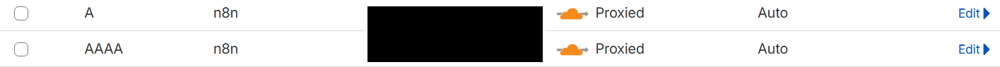
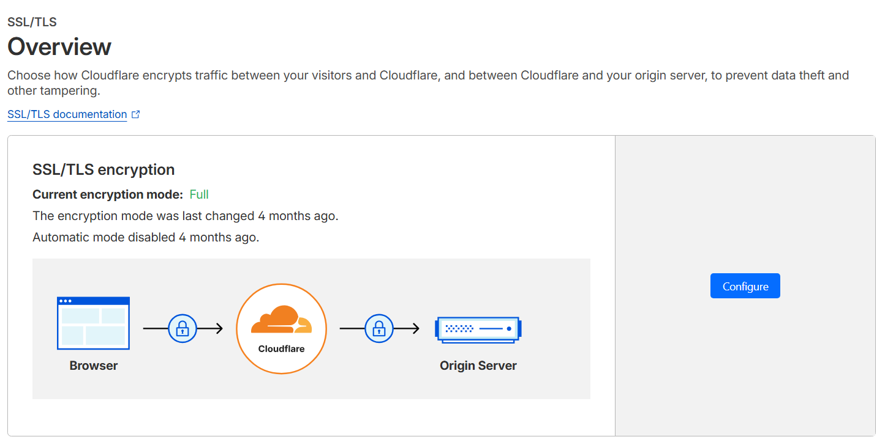

# n8n Docker Setup with Nginx Reverse Proxy and SSL (Cloudflare)

## Overview
This guide describes how to install and run n8n workflow automation tool using [Docker](/docker.md) on Alpine Linux, configure Nginx as a reverse proxy, and secure it with a Let's Encrypt SSL certificate while using Cloudflare for DNS and HTTPS.

---

## Prerequisites
- Alpine Linux 3.22 server
- Domain name managed in Cloudflare, with DNS proxy enabled (orange cloud)
- Ports 80 (HTTP) and 443 (HTTPS) open on your server firewall

### Setup on Cloudflare
The following images show the setup of domain on Cloudflare.


---

## Step 1: Install Docker and Run n8n

```bash
# Update packages
apk update

# Install Docker
apk add docker

# Start Docker service
service docker start

# Enable Docker service at boot
rc-update add docker default

# Pull official n8n Docker image
docker pull n8nio/n8n

# Create persistent data directory
mkdir -p ~/.n8n

# Set proper ownership (user 1000 is the default n8n user inside container)
chown 1000:1000 ~/.n8n

# Run n8n container mapping port 5678; mounting persistent volume
docker run -dit --name n8n -p 5678:5678 -v ~/.n8n:/home/node/.n8n n8nio/n8n
```

---

## Step 2: Install and Configure Nginx

```bash
# Install Nginx and Certbot with nginx plugin
apk add nginx certbot certbot-nginx

# Edit Nginx main config to include conf.d inside http block
nano /etc/nginx/nginx.conf

# Ensure inside 'http {' block you have:
# include /etc/nginx/conf.d/*.conf;

# Create a reverse proxy config for n8n
nano /etc/nginx/conf.d/n8n.conf
```

Add the following content to `/etc/nginx/conf.d/n8n.conf` (replace `YOUR_DOMAIN.COM`):

```conf
server {
    listen 80;
    server_name YOUR_DOMAIN.COM;

    location / {
        proxy_pass http://localhost:5678/;
        proxy_http_version 1.1;
        proxy_set_header Upgrade $http_upgrade;
        proxy_set_header Connection 'upgrade';
        proxy_set_header Host $host;
        proxy_cache_bypass $http_upgrade;
    }
}
```

```bash
# Start and enable Nginx
rc-service nginx start
rc-update add nginx default

# Test Nginx configuration
nginx -t
```

---

## Step 3: Obtain SSL Certificate with Certbot

```bash
# Request SSL certificate (replace with your real domain)
certbot --nginx -d YOUR_DOMAIN.COM
```

- Enter your email when prompted.
- Agree to Terms of Service.
- Disable or enable Cloudflare Proxy (orange cloud) as needed if validation fails.
- Certbot will modify Nginx config automatically to enable HTTPS.

---

## Step 4: Verify Setup

- Visit `https://YOUR_DOMAIN.COM`
- You should see the secure n8n interface.
- Manage Docker container:

```bash
docker start n8n        # Start container
docker stop n8n         # Stop container
docker logs -f n8n      # View logs
```

---

## Troubleshooting

- Cloudflare SSL/TLS mode should be set to **Full (strict)** for end-to-end encryption.
- Keep ports 80 and 443 open.
- Keep Nginx config include line inside the `http {}` block to avoid errors.
- n8n container listens on HTTP internally; Nginx terminates SSL externally.
- Directory `~/.n8n` retains n8n data and workflows across container restarts.