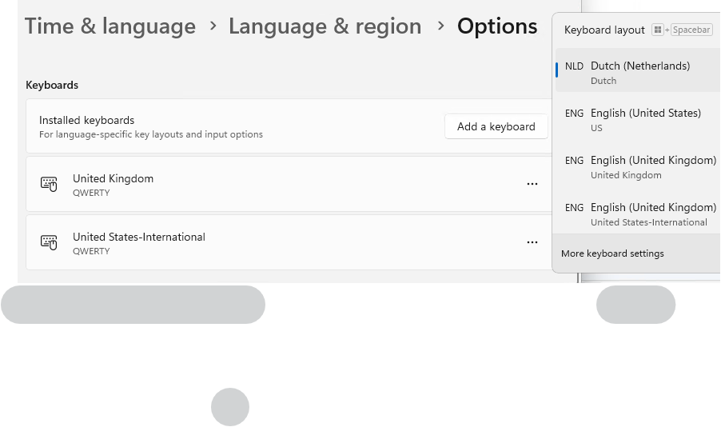

# See the Existing Installed Languages & Keyboards
Either use the built-in PowerShell cmdlet. It might show only some of the keyboards.
```PowerShell
Get-WinUserLanguageList
```
Or use the Registry key/value
```PowerShell
Get-ChildItem -Path "HKLM:\SYSTEM\CurrentControlSet\Control\ContentIndex\Language"
```
Or check the list from the `Settings` menu.
```
Settings --> Time & Languages --> Language & Region
```

# Fix issues with Windows Languages & Keyboard Layouts
## Remove Unwanted Languages (e.g., British English - UK Language)
Windows is stupid and, for unknown reasons (at least to me), add some languages you didn't ask for. It is no surprise that you can't remove them as you have not added them 🙄

You could take these steps to fix it.

1. Go to the Languages and Keyboards settings. You can follow these steps in Windows 11 to see the list of all installed languages and keyboard layouts.
```
Settings --> Time & Languages --> Language & Region
```
2. Add all the languages and/or keyboards you see in the language bar (`Win + Space`) but do not see in the settings (previous step).<br>
<br>
  🔸Uncheck all the features in the pop window.<br>
  🔸Add all `languages` and `keyboards` (from _Language Options_).
3. Remove unwanted languages and/or keyboards from the settings.
