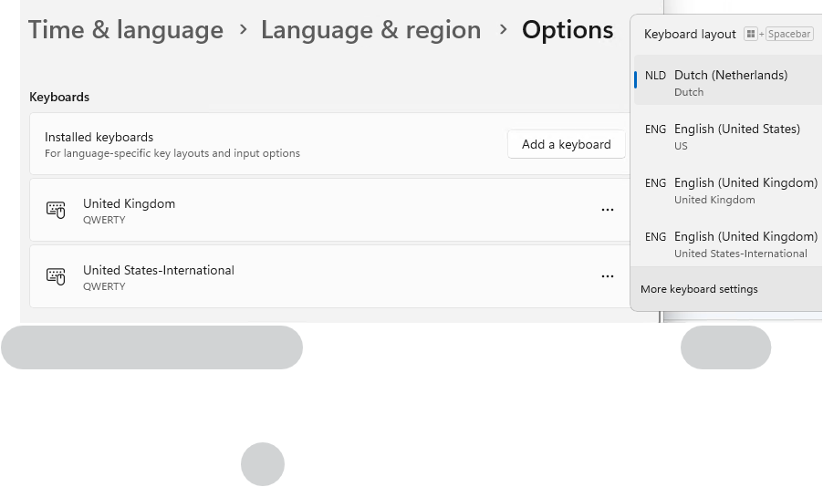

# Set Keyboard Layouts to English (US) and Persian (Standard)

Run the following PowerShell script as Administrator to lock your keyboard layouts. This script removes hidden keyboards, blocks Remote Desktop from changing them, and disables Microsoft Account language syncing.

```powershell
# 1. Force the exact Language List (Wipes everything else)
$LangList = New-WinUserLanguageList en-US
$LangList[0].InputMethodTips.Clear()
$LangList[0].InputMethodTips.Add('0409:00000409') # English (US)

$Persian = New-WinUserLanguageList fa-IR
$Persian[0].InputMethodTips.Clear()
$Persian[0].InputMethodTips.Add('0429:00050429') # Persian (Standard)

$LangList += $Persian[0]
Set-WinUserLanguageList $LangList -Force

# 2. Registry Fix: Block RDP from injecting host keyboards (Crucial for VMs)
$RegKeyKbdLayout = "HKLM:\SYSTEM\CurrentControlSet\Control\Keyboard Layout"
if (!(Test-Path $RegKeyKbdLayout)) { New-Item -Path $RegKeyKbdLayout -Force | Out-Null }
Set-ItemProperty -Path $RegKeyKbdLayout -Name "IgnoreRemoteKeyboardLayout" -Value 1 -Type DWord -Force

# 3. Registry Fix: Clear and rebuild the Preload keys for Current User & Default Profile
$PreloadCU = "HKCU:\Keyboard Layout\Preload"
$PreloadDef = "Registry::HKEY_USERS\.DEFAULT\Keyboard Layout\Preload"

# Wipe existing preloads completely
Remove-Item -Path $PreloadCU -Recurse -Force -ErrorAction SilentlyContinue
New-Item -Path $PreloadCU -Force | Out-Null
Remove-Item -Path $PreloadDef -Recurse -Force -ErrorAction SilentlyContinue
New-Item -Path $PreloadDef -Force | Out-Null

# Lock in only the two correct keyboards
Set-ItemProperty -Path $PreloadCU -Name "1" -Value "00000409" -Type String -Force
Set-ItemProperty -Path $PreloadCU -Name "2" -Value "00050429" -Type String -Force
Set-ItemProperty -Path $PreloadDef -Name "1" -Value "00000409" -Type String -Force
Set-ItemProperty -Path $PreloadDef -Name "2" -Value "00050429" -Type String -Force

# 4. Registry Fix: Disable Microsoft Account Language Syncing
$SyncKey = "HKCU:\Software\Microsoft\Windows\CurrentVersion\SettingSync\Groups\Language"
if (!(Test-Path $SyncKey)) { New-Item -Path $SyncKey -Force -ItemType Directory | Out-Null }
Set-ItemProperty -Path $SyncKey -Name "Enabled" -Value 0 -Type DWord -Force

Write-Host "Keyboard layouts fixed and locked! Please restart your VM for all registry changes to take effect." -ForegroundColor Green

```

---

# Check Existing Installed Languages & Keyboards

You can check your installed languages using one of these three methods:

**Method 1: PowerShell Cmdlet**
This command shows the standard list of installed languages.

```powershell
Get-WinUserLanguageList

```

**Method 2: Registry Keys**
These commands show hidden or preloaded keyboard layouts for the default user and the current user.

```powershell
Get-ItemProperty -Path "Registry::HKEY_USERS\.DEFAULT\Keyboard Layout\Preload"
Get-ItemProperty -Path "HKCU:\Keyboard Layout\Preload"

```

**Method 3: Windows Settings**
Navigate through the graphical interface:
`Settings -> Time & language -> Language & region`

---

# Fix Issues with Ghost Keyboard Layouts

Sometimes Windows adds unwanted keyboard layouts (like UK English) that do not appear in the Settings menu. Because they are hidden, you cannot remove them normally. Choose one of the options below to fix this issue.

## Option 1: PowerShell Override (Recommended)

This command overwrites the language list and sets it strictly to English (US).

```powershell
$US_Language = New-WinUserLanguageList en-US
Set-WinUserLanguageList $US_Language -Force

```

## Option 2: The "Add to Delete" Trick (GUI)

If a language shows up on your taskbar but not in your settings, you must manually install it in order to remove it.

1. Go to `Settings -> Time & language -> Language & region`.
2. Click **Add a language** and search for the unwanted language (e.g., English UK).
3. Uncheck all optional features (like Text-to-Speech or Handwriting) and install it.<br>
<br>
4. Once the language appears in your settings list, click the three dots `...` next to it and select **Remove**.

## Option 3: Clear Registry Keys

*Note: Always back up your registry before making changes.*

Run these commands in PowerShell to delete the hidden preload cache. You must restart your computer afterward.

```powershell
Remove-ItemProperty -Path "Registry::HKEY_USERS\.DEFAULT\Keyboard Layout\Preload" -Name *
Remove-ItemProperty -Path "HKCU:\Keyboard Layout\Preload" -Name *

```
