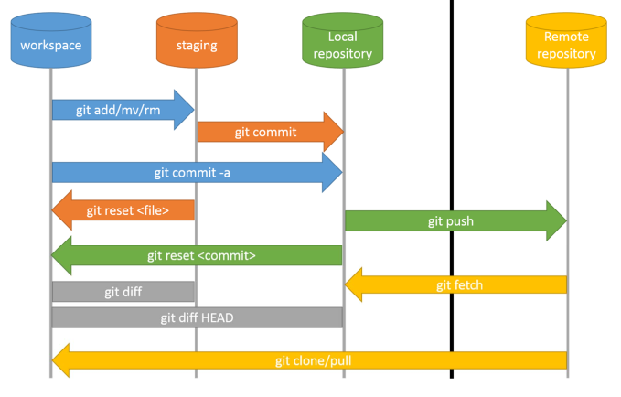
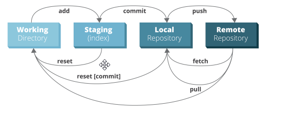

# Concepts
- Files can be in one of three states: Modified, Staged, Committed.  
  - By **modifying** a file, the change will only be found in the working directory (workspace).
  - By **staging** the changes, they will be included in the next _commit_. To add a file to a _commit_, you first need to add it to the **staging** environment.
  - To store _staged_ files in the repo, we need to **commit** them. A **commit** is a record of what changes you have made since the last time you made a commit.
- It is possible to **reset** _commit(s)_ to discard commits that you no longer need.
- **Pushing** the _commit_ in a _branch_ to a repository (pushing changes) allows other people to see the changes; share changes with others.
- To update the local repository (workspace) with the latest _pushes_, we need to **pull** changes.
- A **pull request** (or PR) is a way to alert a repo's owners that you want to make some changes to their code.
- **Branches** are independent lines of development. They allow you to move back and forth between 'states' of a project.  
  - By default, every Git repository’s first **branch** is usually named `master`. Every repository has a primary **branch** that can be thought of as the official version of the repository.
  - Whenever you switch to another _branch_ with uncommitted changes (or new files added) in your working folder, these uncommitted changes will also be carried to the new branch that you switch to. Changes that you commit will be committed to the newly switched branch.
- Different _branches_ can be **merged** into any one branch as long as they belong to the same repository.
- A Git **tag** is used to label and mark a specific commit in the history. Tags are commonly used to indicate release versions, with the release name (i.e., v1.0) being the name of the tag.



# Commands
## Initializing a Repository
- It will initialize and empty Git repository in `<path_to_directory>/.git/` on the local system.
- A new repository needs to be pushed to the remote repository
- Run `git init` with no arguments to initialize the current directory as a git repository.
```bash
### Initialize a Git Repository
git init <path_to_directory>

### Clone a repository to the local system
git clone <repository_address>
```

### Staging
```bash
##################################
# View the status of the project #
##################################
### Show modified files in working directory, staged for your next commit
git status

### Show the status in 2 columns: staging area and working directory (workspace)
git status -s

### Meaning of the letters when getting the status (git status -s)
?   Not added to cache
A   Locally added files
M   The content or mode of the file has been modified
AM  After the file is added to the cache, it needs to be added by git again
D   Files deleted locally
R   Modify file name


###########################
# Add file(s) to a Commit #
###########################
### Add a file as it looks now to your next commit (stage)
git add <file_name>

## Add files are changed
git add -u

### Add all modified files to a commit
git add .

### Add all files in the wildcard fashion (e.g. start with "fil")
git add fil*

### Add multiple files
git add <file_name1>,<file_name2>,<file_name3>


###################
# Unstage / Reset #
###################
### Unstage (discard uncommitted) changes in working directory
git restore <file_name>

### Reset the index to discard changes in the working directory
git reset


######################
# See the difference #
######################
### Show the difference of what is changed but not staged
git diff

### Show the difference of a specific file
git diff <file_name>

### Show only the list of the modified files
git diff --name-only

### Show the difference of what is changed but not yet committed
git diff --staged


####################
### Commit changes #
####################
### Commit your staged content (changes) as a new commit snapshot
git commit -m "Message for the commit."

### Stage All Modified Files to be Committed
git commit -a

### Combination of the Last 2 Options
git commit -am "Message for the commit."

### Update an Existing Commit
### After adding a file and committing it, we can amend a new commit to it
### Replace the last commit with the staged changes and last commit combined.
git commit --amend


############################
# Remove files and folders #
############################
### Remove a file
git rm <file_name>

### Remove a file from staging area but keep it in the working directory (workspace)
git rm --cached <file_name>

### Remove a file from staging area and the working directory (workspace)
git rm -f <file_name>

### Remove a directory recursively
git rm -r <folder_name>


##################################
# Move or rename files & folders #
##################################
### Rename a a file
git mv <old_file_name> <new_file_name>
```

## Branching
```bash
### List Existing Branches
### A * will appear next to the currently active branch
git branch

### Show all branches (with remote)
git branch -a

### Delete Branches
git branch -d <branch_name>

### Create a New Local Branch
git branch <new_branch_name>

### Switch to an existing branch and check it out into your working directory
git checkout <existing_branch_name>

### Create a New Local Branch and Move to (Check You Out on) it
git checkout -b <new_branch_name>

### Checkout for Remote Branches
git checkout --track origin/<remote_branch_name>

### Merge <another_branch_name> to the current branch
### If we are currently on the "master" branch, it will merge <another_branch_name> into the "master" one.
git merge <another_branch_name>
```

## Pushing Changes to the Repository
```bash
### Push Changes onto a Branch (of the Repository)
### Pushing changes to the <branch_name> branch (the branch on the remote Repository)
git push origin <branch_name>

### Push Changes onto an Existing Branch (of the Repository)
git push -u origin <existing_branch_name>
```

## Pulling Changes from the Repository
```bash
### Get changes on the remote repository to the local repository (update it and merge changes)
git pull origin master

### pull all changes from the remote repository to the local repository
git pull --all
```

## Configuration
- The file `.gitignore` contains files to be ignored while pushing commits.
```bash
### List the existing configuration
git config -l

### Open the global configuration file in a text editor for manual editing.
git config --global --edit

### Define the author name to be used for all commits by the current user.
git config --global user.name <name>

### Define the author email to be used for all commits by the current user
git config --global user.email <email>

### Store login credentials in the cache
git config --global credential.helper cache

### set automatic command line coloring for Git for easy reviewing
git config --global color.ui auto

### An example of the file .gitignore
/logs/*
/logs/.gitkeep
/tmp
*.swp
```

## Status and Log
- `git log` displays the entire commit history using the default format.
```bash
### List which files are staged, un-staged, and untracked
git status

### Display committed snapshots
### Show the commit history for the currently active branch
git log

### show the commit log as a graph
git log --graph --oneline


### See a specific commit
git show <commit_id>
```

##### Sources
- [An Intro to Git and GitHub for Beginners](https://product.hubspot.com/blog/git-and-github-tutorial-for-beginners)
- [Learn Git with Bitbucket Cloud](https://www.atlassian.com/git/tutorials/learn-git-with-bitbucket-cloud)
- [Git foundation and introduction](https://programmer.group/enterprise-level-automation-code-release-git-foundation-and-introduction.html)
- [Backlog Git Tutorial](https://backlog.com/git-tutorial/)
