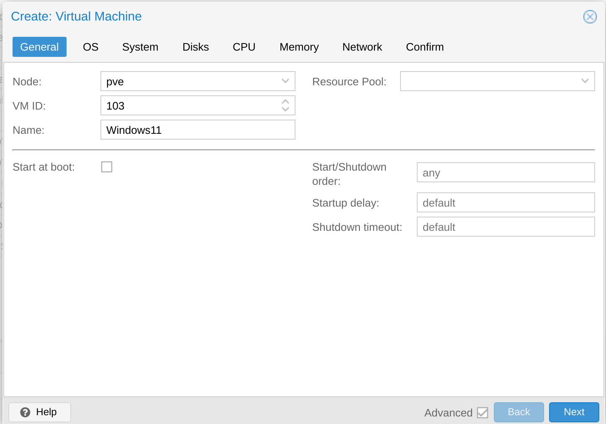
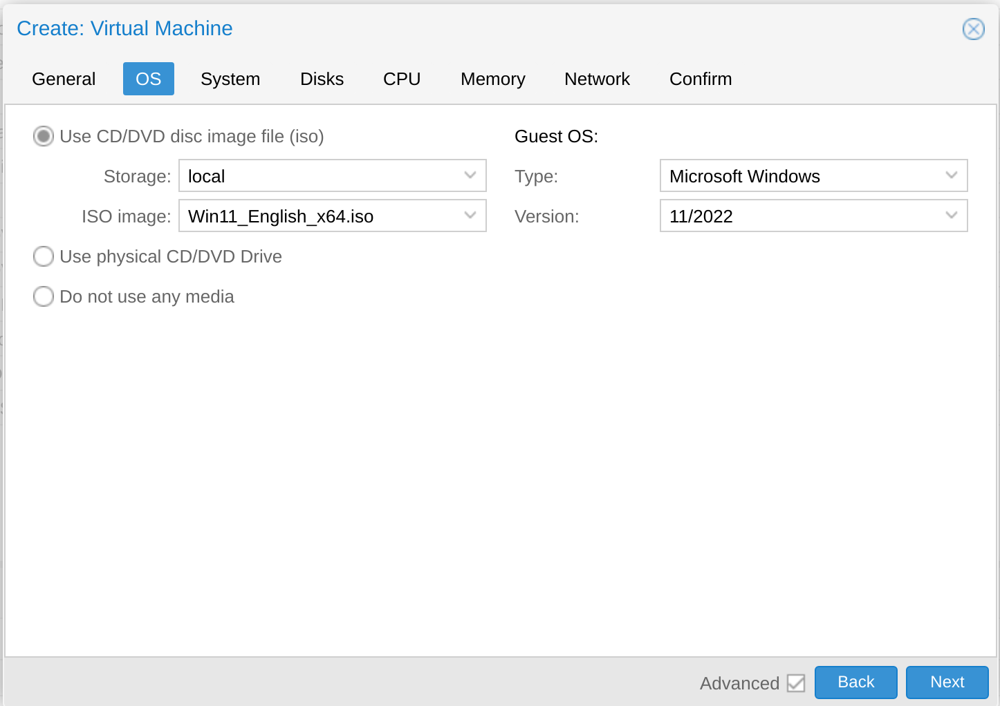
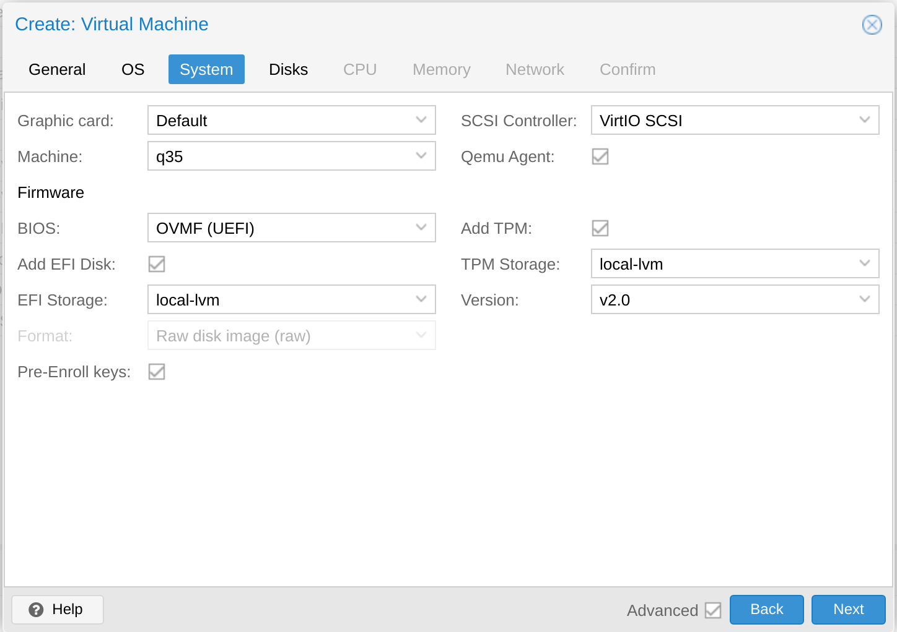
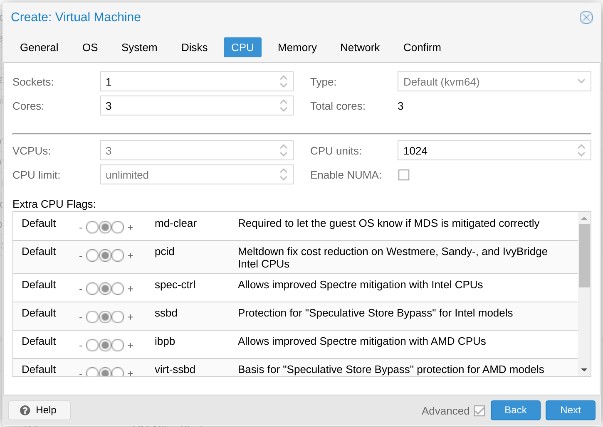
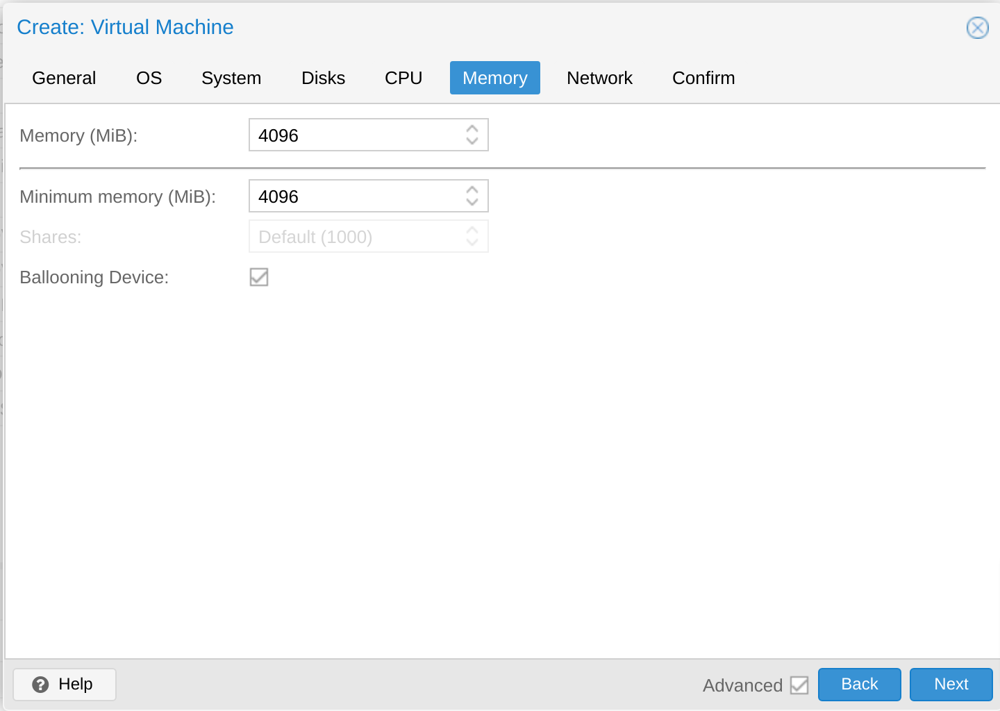
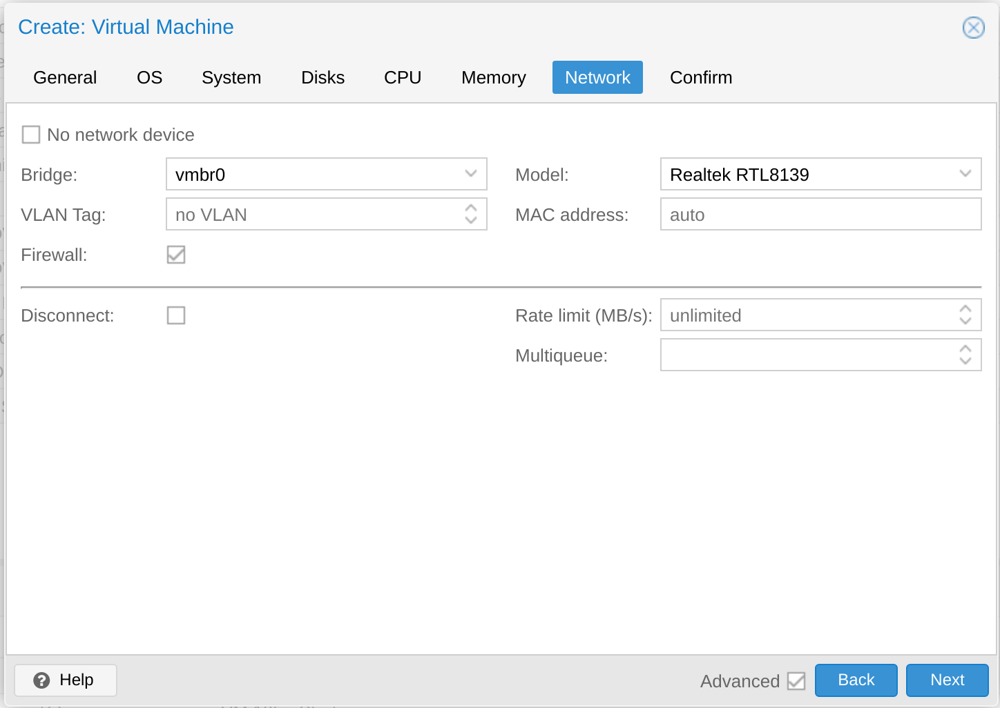

# Enable Nested Virtualization
Change the process type to `Host` via `Hardware -> Process -> Type` in the VM settings.
# Install Windows 10/11 on Proxmox Virtual Environment (PVE) 7.1-5
## 0- General

## 1- OS
Guest Host: Windows -> 11/2022

## 2- System

## 3- Disks

## 4- CPU
As you desire

## 5- Memory
As you desire; min 4096 MB

## 6- Network
Model: VirtIO

