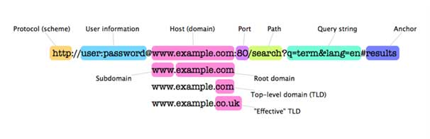
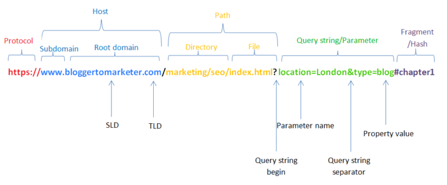

## Get the Username from Different Windows Event IDs
```bash
### . means any chars excluding new line while [\s\S] means any char

# get the account names from the Windows event ID 4723, 4724, 4725, and 4726
Subject:[\s\S]+Account\sName:\s+(?<Subject_Account>\S*)[\s\S]+(Target|New)\sAccount:[\s\S]+Account\sName:\s+(?<Target_Account>\S*)\s+Account\sDomain:

# get the account names from the Windows event ID 4624 and 4625
Subject:[\s\S]+Account\sName:\s+(?<Subject_Account>\S*)[\s\S]+New\sLogon:[\s\S]+Account\sName:\s+(?<Target_Account>\S*)\s+Account\sDomain:
```

## Get URL
Here is the [structure of a URL](https://en.wikipedia.org/wiki/URL):




This regex extracts URL elements, including scheme, user, subdomain, domain, tld, path, query, and fragmentation. It still needs some improvements because the 3rd group (subdomain, domain, TLD) is not working perfectly.
```regex
(?i)(?<scheme>http|https|ftp|sftp|sip|sips|file):\/\/(?:(?<username>[^`!@#$^&*()+=,:;'"{}\|\[\]\s\/\\]+)(?::(?<password>[^`!@#$^&*()+=,:;'"{}\|\[\]\s\/\\]+))?@)?(?:(?<ipv4>((?:(?:25[0-5]|2[0-4]\d|1?\d\d?)\.){3}(?:25[0-5]|2[0-4]\d|1?\d\d?)))|\[(?<ipv6>(?i)(?:[\da-f]{0,4}:){1,7}(?:(?<ipv4_in_ipv6>(?:(?:25[0-5]|2[0-4]\d|1?\d\d?)\.){3}(?:25[0-5]|2[0-4]\d|1?\d\d?))|[\da-f]{0,4}))\]|(?:(?<sub_domain>[^\s~`!@#$%^&*()_+=,.?:;'"{}\|\[\]\/\\]+\.)*(?<domain>[^\s~`!@#$%^&*()_+=,.?:;'"{}\|\[\]\/\\]+)(?<tld>\.[^\s~`!@#$%^&*()\-_+=,.?:;'"{}\|\[\]\/\\0-9]{2,})))+(?<port>:\d+)?(?:\/(?<path>\/?[^\s`@#$^&=.?"{}\\]+\/)*(?<file>[^\s`@#$^&=?"{}\/\\]+)?(?<query>\?[^\s`#$^"{}\\]+)*(?<fragment>#[^\s`$^&=?"{}\/\\]+)?)?
```
[Demo](https://regex101.com/r/R2d1aA/2)

## Get IPv4
```regex
(?:(?:25[0-5]|2[0-4]\d|1?\d\d?)\.){3}(?:25[0-5]|2[0-4]\d|1?\d\d?)
```
[Demo](https://regex101.com/r/BZ1ulJ/2)

## Get IPv6
```regex
(?i)(?:[\da-f]{0,4}:){1,7}(?:(?<ipv4>(?:(?:25[0-5]|2[0-4]\d|1?\d\d?)\.){3}(?:25[0-5]|2[0-4]\d|1?\d\d?))|[\da-f]{0,4})
```
[Demo](https://regex101.com/r/uwPxJf/1) - Read More: [RIPE](https://www.ripe.net/participate/member-support/lir-basics/ipv6_reference_card.pdf)
